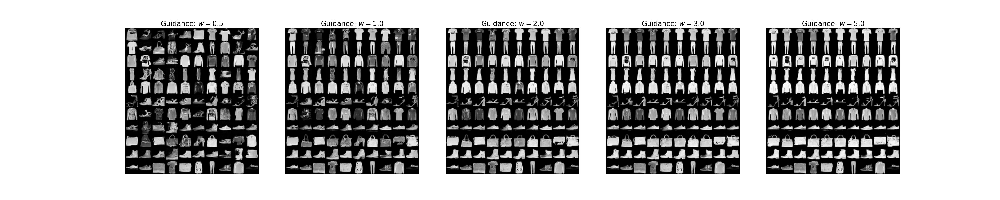
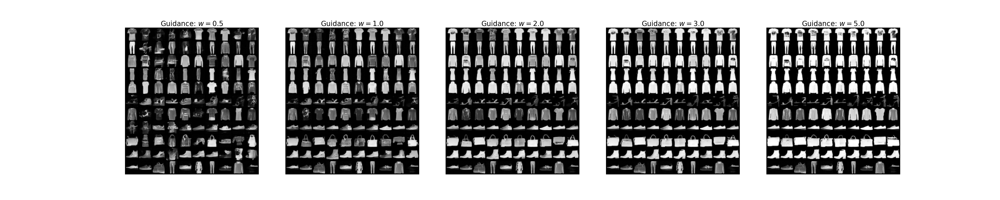
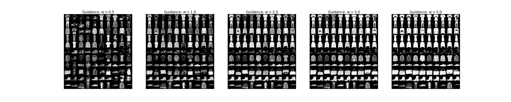
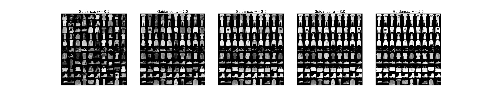
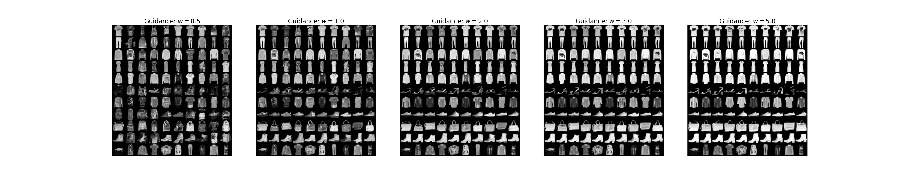
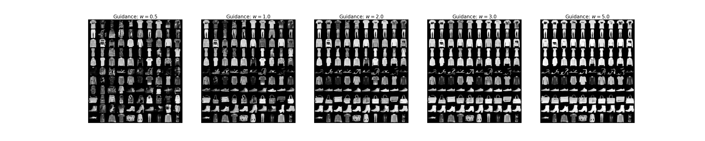
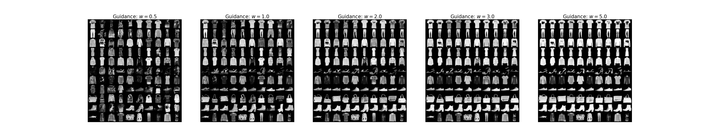

# Flow Matching Ablation Study Results

**Guidance Scales Tested:** 0.5, 1.0, 2.0, 3.0, 5.0 (shown as columns in each image)

**Data Fractions:** 0.1, 0.25, 0.5, 1.0

**Inference Steps:** 10, 25, 50, 100, 200

---

## Data Fraction: 10% (0.1)

### 10 Steps

### 25 Steps

### 50 Steps

### 100 Steps

### 200 Steps

---

## Data Fraction: 25% (0.25)

### 10 Steps

### 25 Steps

### 50 Steps

### 100 Steps

### 200 Steps

---

## Data Fraction: 50% (0.5)

### 10 Steps

### 25 Steps

### 50 Steps

### 100 Steps

### 200 Steps

---

## Data Fraction: 100% (1.0)

### 10 Steps

### 25 Steps

### 50 Steps

### 100 Steps

### 200 Steps

---

## Comparison Tables

### By Data Fraction (100 Steps)

| Data Fraction | Image |
|---------------|-------|
| 10% |  |
| 25% |  |
| 50% |  |
| 100% |  |

### By Inference Steps (100% Data)

| Steps | Image |
|-------|-------|
| 10 |  |
| 25 |  |
| 50 |  |
| 100 |  |
| 200 |  |
